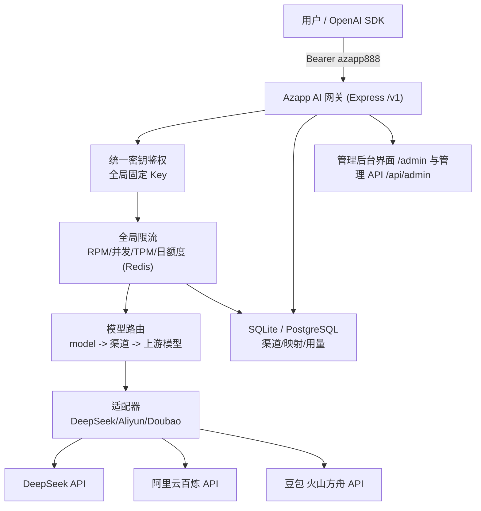

# OpenAI 兼容 AI API 聚合中转站 · 设计与实现

对外提供 OpenAI 风格接口（`/v1/chat/completions`、`/v1/models`），把请求按 `model` 路由到 DeepSeek、阿里云百炼、豆包（火山方舟）三家上游；下游用户持有全局统一的接入密钥（默认 `azapp888`），不接触上游密钥。

---

## 1. 整体架构



请求链路（文字）：

1. SDK 带 `Authorization: Bearer azapp888`（可用 `GATEWAY_API_KEY` 修改）请求 `/v1/chat/completions`。
2. 鉴权：与全局固定密钥做常量时间比较，不匹配返回 401；不按用户/令牌封禁。
3. 路由：按 `model` 查 `model_mappings`，得到渠道与上游模型名（白名单之外直接 404）。
4. 限流（Redis）：RPM → 并发 → TPM 预留 → 日额度预留；任一超限返回 429。
5. 适配：解密渠道密钥，按厂商适配器构造上游请求（DeepSeek/百炼走 OpenAI 兼容端点，豆包做字段转换）。
6. 转发：非流式解析 JSON，流式边转发 SSE 边解析 `usage`；响应结束按真实 token 结算限流额度并写 `usage_logs`。
7. 返回：字段与 OpenAI 一致（`id`、`object`、`choices`、`usage`）。

---

## 2. 现成网关 vs 自研

| 维度 | New API / One API（推荐快速上线） | 自研（本仓库实现） |
|---|---|---|
| 上线速度 | 小时级，Docker 一键起 | 天级 |
| 渠道/适配 | 内置几十家，开箱即用 | 自行维护三家 |
| 计费/后台 | 现成管理后台、充值、分组 | 需自己写（本仓库已含基础版） |
| 限额能力 | 分组倍率、令牌额度、模型限制、RPM 等 | 完全可控，按需求定制 |
| 反代防护 | 依赖模型白名单 + 分组 + 额度 | 可加 IP 白名单、TPM 预留、行为风控 |
| 可定制性 | 受限于项目结构（Go/React） | 完全自主 |
| 维护成本 | 跟随上游社区升级 | 自己承担 |

结论：想尽快上线选 **New API**（One API 的活跃分支）；需要精细的防反代、IP 白名单、TPM 预留结算、与自有用户体系打通时选**自研**。本仓库走自研路线。

---

## 3. 用 New API / One API 快速实现

1. 部署：`docker run -d --name new-api -p 3000:3000 -v new-api-data:/data calciumion/new-api:latest`（或 One API 镜像）。
2. 登录后台，创建**渠道**：
   - DeepSeek：类型 `DeepSeek`，Base URL `https://api.deepseek.com`，填入上游 Key。
   - 阿里云百炼：类型 `阿里云通义千问`（或自定义 OpenAI 兼容渠道），Base URL `https://dashscope.aliyuncs.com/compatible-mode/v1`。
   - 豆包：类型 `火山方舟`（或自定义 OpenAI 兼容渠道），Base URL `https://ark.cn-beijing.volces.com/api/v3`，模型填接入点 `ep-xxxx` 或模型名。
3. 配置**模型**：把你决定开放的公开模型名逐个绑定到对应渠道；模型名以上游厂商实际提供为准。
4. 创建**令牌**：设置额度（日额度）、过期时间、允许模型、允许 IP（部分版本支持）。
5. 创建**分组**：把免费/付费用户分组，设置不同倍率与 RPM。
6. 在「系统设置 → 限流」设置全局 RPM/TPM；在渠道设置渠道级限流。
7. 对外域名反代到 New API 的 3000 端口，强制 HTTPS。

注意：New API 的令牌 IP 白名单与 TPM 粒度在不同版本差异较大，若必须精确到「每令牌 IP 白名单 + TPM 预留」，自研更可控。

---

## 4. 自研实现（本仓库）

### 4.1 目录

```
src/
├── app.js                     # Express 实例，挂载 /v1 与 /api
├── bootstrap.js               # 启动初始化存储/限流
├── config.js                  # 环境变量
├── adapters/index.js          # DeepSeek / 阿里云 / 豆包适配器
├── db/schema.sql              # PostgreSQL 表结构
├── lib/
│   ├── crypto.js              # 上游密钥 AES-256-GCM 加解密
│   ├── keys.js                # （旧令牌工具，保留兼容）
│   ├── limits.js              # token 预估
│   ├── openai.js              # OpenAI 错误结构
│   ├── password.js            # bcrypt 密码
│   └── redis.js               # Redis 客户端
├── middleware/
│   ├── apiKey.js              # /v1 全局统一密钥鉴权
│   └── auth.js                # 后台 JWT 鉴权
├── routes/
│   ├── v1.js                  # OpenAI 兼容接口
│   ├── admin.js               # 管理后台 API
│   └── ...
├── services/
│   ├── ratelimit.js           # RPM/并发/TPM/日额度（Redis + Lua，含内存实现）
│   └── upstream.js            # 上游转发 + SSE 解析 + mock
├── public/admin/index.html    # 管理后台界面（单页，零构建，挂在 /admin）
└── store/
    ├── postgres.js            # PostgreSQL 实现
    ├── memory.js              # 内存实现（本地零依赖运行）
    └── seed.js                # 种子数据
```

### 4.2 表结构

| 表 | 作用 | 关键字段 |
|---|---|---|
| `users` | 管理员账号 | `username`、`password_hash`、`role`、`status` |
| `channels` | 上游渠道 | `provider`、`base_url`、`api_key_enc`（AES-256-GCM 密文） |
| `model_mappings` | 模型路由 | `model_name`（公开）、`channel_id`、`upstream_model`、`enabled` |
| `usage_logs` | 用量明细 | `token_id`、`prompt_tokens`、`completion_tokens`、`total_tokens`、`latency_ms`、`status` |

> 下游鉴权使用全局固定密钥（`GATEWAY_API_KEY`，默认 `azapp888`），不再使用按用户/按令牌的 `api_tokens`，也不做按用户封禁。

完整 DDL 见 `src/db/schema.sql`。上游密钥只落密文，后台接口返回时已剔除 `api_key_enc`。

### 4.3 核心接口

- `GET /admin`：内置可视化管理后台（单页，无需构建）。登录后进入「开始配置」向导：先填各服务商密钥，再逐个添加模型，最后复制统一接入密钥。
- `GET /v1/models`：返回已配置且启用的模型。
- `POST /v1/chat/completions`：鉴权 → 路由 → 限流 → 适配转发 → 结算 → 记账，支持 `stream`。
- `POST /api/admin/login`：后台登录，返回 JWT 与当前用户信息。
- `GET /api/admin/access-key`：返回全局统一接入密钥与限流配置。
- `POST /api/admin/mappings`、`PATCH /api/admin/mappings/:id`：新增/启停模型映射；`GET /api/admin/mappings` 查看全部（含停用）。模型完全由你在后台维护，不限固定几个。
- `GET /api/admin/usage?from=&to=`：用量汇总（总量 / 按模型 / 按天）。

### 4.4 限流实现（`src/services/ratelimit.js`）

采用**预留-结算**：

- RPM：固定分钟窗口 `INCR` + 首次 `PEXPIRE`，超限拒绝。
- 并发：`INCR` 获取，超限 `DECR` 回滚；请求结束释放，并有 5 分钟兜底过期，防止进程崩溃后泄漏。
- TPM：请求前按 `prompt 预估 + max_tokens` 预留，响应后按真实 `usage` 结算差额，避免单次大请求击穿。
- 日额度：Redis 键按天，TTL 到次日零点；达到上限直接拒绝。
- Redis 操作全部用 Lua 保证原子性；无 Redis 时自动切换内存实现（单机默认）。

### 4.5 部署

完整方案（多实例 / 有独立数据库）：

```bash
cp .env.example .env
# 生成强随机密钥
openssl rand -hex 32   # 填入 JWT_SECRET 与 ENCRYPTION_KEY
docker compose up -d --build
# 首次启动自动建表并写入渠道/模型映射；也可手动 npm run seed
curl http://localhost:8100/api/health
```

单机（RK3566 / Debian ARM64，见第 6 节）：不跑 Postgres/Redis，用 SQLite。

```bash
GATEWAY_STORE=sqlite GATEWAY_REDIS=memory npm start
```

本地零依赖运行（内存存储 + mock 上游）：

```bash
GATEWAY_STORE=memory GATEWAY_REDIS=memory MOCK_UPSTREAM=true npm start
```

### 4.6 SDK 调用示例

```python
from openai import OpenAI

client = OpenAI(base_url="https://openai.azayu.top/v1", api_key="azapp888")
resp = client.chat.completions.create(
    model="deepseek-chat",  # 换成你在后台添加的“对外模型名”
    messages=[{"role": "user", "content": "你好"}],
)
print(resp.choices[0].message.content)
```

> `api_key` 为全局统一接入密钥（默认 `azapp888`，可用 `GATEWAY_API_KEY` 修改），所有用户共用。

### 4.7 模型与渠道：全部后台维护

模型不写死，系统也不预置任何模型。`model_mappings` 就是白名单，只有你在后台添加并启用的模型才可被调用。推荐使用管理后台的「开始配置」向导：

1. 打开 `https://openai.azayu.top/admin` 登录。
2. 第 1 步：为 DeepSeek、阿里云百炼、豆包填入各自的 API Key（预置的三个渠道是真实厂商地址，密钥加密存储、页面不回显）。
3. 第 2 步：逐个添加模型，填写「对外模型名」「上游模型名」「走哪个渠道」。上游模型名必须与厂商文档/控制台完全一致。
4. 第 3 步：复制全局统一接入密钥，发给使用方（所有用户共用，不做按用户封禁）。

也可用 API 操作：

```bash
# 登录拿 admin JWT
JWT=$(curl -s https://openai.azayu.top/api/admin/login \
  -H "Content-Type: application/json" \
  -d '{"username":"admin","password":"<你的密码>"}' | jq -r .token)

# 填渠道密钥（channel_id 见 /api/admin/channels）
curl -s -X PATCH https://openai.azayu.top/api/admin/channels/ch_deepseek \
  -H "Authorization: Bearer $JWT" -H "Content-Type: application/json" \
  -d '{"api_key":"<上游密钥>"}'

# 逐个新增模型（上游模型名以厂商文档为准）
curl -s https://openai.azayu.top/api/admin/mappings \
  -H "Authorization: Bearer $JWT" -H "Content-Type: application/json" \
  -d '{"model_name":"deepseek-chat","channel_id":"ch_deepseek","upstream_model":"deepseek-chat"}'

# 停用某模型（enabled=false，不会删除记录）
curl -s -X PATCH https://openai.azayu.top/api/admin/mappings/<mapping_id> \
  -H "Authorization: Bearer $JWT" -H "Content-Type: application/json" \
  -d '{"enabled":false}'
```

- 默认不预置任何模型；如确有需要，可用 `DEFAULT_MODEL_MAPPINGS` JSON 一次性预置。
- 下游使用全局统一密钥（`GET /api/admin/access-key` 可查看），模型层面无需再做授权。

### 4.8 域名与反向代理（openai.azayu.top）

服务监听 `8100`，由你的服务器上的 Nginx 反代到 `openai.azayu.top`。完整配置见当前工作区内的 `/deploy/nginx/openai.azayu.top.conf`，要点：

- 流式必须 `proxy_buffering off`，否则 SSE 会被一起缓冲、破坏逐字输出。
- 设置 `X-Forwarded-For`，便于在用量日志中记录真实客户端 IP。
- `client_max_body_size` 限制请求体，`proxy_read_timeout 3600s` 适配长回复。
- 管理接口 `/api/` 建议限制来源 IP；`/v1/` 对外。

上线步骤：

```bash
# 1. 拷贝 nginx 配置并替换证书路径，reload
# 2. 用 certbot 签发 openai.azayu.top 证书
# 3. .env 设 CORS_ORIGINS=https://openai.azayu.top
docker compose up -d --build
```

SDK 的 `base_url` 即 `https://openai.azayu.top/v1`。

---

## 5. 防反代（防 IDE 刷量）完整配置清单

### 5.1 已在代码中实现

- [x] 全局统一密钥：所有下游用户共用同一把 `GATEWAY_API_KEY`（默认 `azapp888`），鉴权为常量时间比较；不需要逐个发令牌，也不对个别用户封禁。
- [x] 模型白名单：以「后台已配置的模型」为准，未配置的模型直接 404。模型可随时在后台增删、启停，不限固定几个。
- [x] 全局限流：RPM / 并发 / TPM / 日额度（默认 `60 RPM / 5 并发 / 60k TPM / 日额度不限`，可用环境变量调整，0 表示不限）。
- [x] TPM 预留结算：防止超大请求一次性击穿分钟额度。
- [x] 上游密钥加密落库（AES-256-GCM），接口返回已脱敏。
- [x] 请求体上限 1MB，流式响应统一解析 usage 记账。
- [x] 豆包适配器强制 `n=1`。

### 5.2 部署与运维加固

- [ ] 关闭浏览器跨域：API 由 SDK 调用，`CORS_ORIGINS` 收紧到管理后台域名，不要用 `*`。
- [ ] 全站 HTTPS，网关置于 Nginx/云 LB 之后，开启 `X-Forwarded-For` 传递真实 IP。
- [ ] 不要暴露 `/v1` 之外的内部端口；数据库只在内网。
- [ ] 统一密钥请勿公开分发；若泄漏，修改 `GATEWAY_API_KEY` 并重启即可全量失效。
- [ ] 关闭或限制 `tools` / `function calling`（IDE 反代高度依赖）。
- [ ] 限制单请求最大 prompt 长度与消息条数。
- [ ] 上游账号开启账单告警，按日核对上游消耗与本地 `usage_logs`。
- [ ] 定期轮换上游密钥与 `ENCRYPTION_KEY`（轮换需重写 `channels.api_key_enc`）。
- [ ] 管理后台强密码 + 限制来源 IP；JWT 密钥独立于加密密钥。
- [ ] 增加审计日志：记录 IP、模型、token、耗时、状态，便于溯源。

### 5.3 建议的限额参数

| 限制项 | 默认值 | 说明 |
|---|---|---|
| RPM | 60 | 环境变量 `GATEWAY_RPM`，0 表示不限 |
| 并发 | 5 | 环境变量 `GATEWAY_CONCURRENCY`，0 表示不限 |
| TPM | 60k | 环境变量 `GATEWAY_TPM`，0 表示不限 |
| 日额度 | 不限 | 环境变量 `GATEWAY_DAILY_TOKEN_LIMIT`，0 表示不限 |
| 模型白名单 | 后台已配置模型 | 未配置的模型 404 |

---

## 6. RK3566 / Debian ARM64 单机部署优化

目标硬件：瑞芯微 RK3566 四核 A55（aarch64）、4GB RAM、8GB eMMC、SATA 3.0 硬盘位、千兆网口。

### 6.1 针对该硬件的取舍

| 约束 | 决策 | 原因 |
|---|---|---|
| 8GB eMMC 空间小 | 不用 Docker 跑 Postgres/Redis，改单文件 SQLite | 数据库+缓存镜像会占掉数 GB |
| eMMC 写入寿命有限 | SQLite 放 SATA 盘，开启 WAL，日志交给 journald 并限 200M | 减少 eMMC 写放大 |
| 4GB RAM 需留余量 | 限流用进程内存，不做多实例 | 少两个常驻进程，省内存 |
| ARM64 架构 | Node 22 官方 ARM64 源原生安装 | 避免在设备上慢速构建镜像 |
| 单网口 | Nginx 反代 + HTTPS | 对外只暴露 443 |

### 6.2 一键安装（裸机 systemd，推荐）

```bash
# 将仓库放到服务器后
sudo bash deploy/install-debian.sh
```

脚本会：安装 Node 22（ARM64）与 Nginx、创建 `azapp` 用户、把代码放到 `/opt/azapp`、生成 `/etc/azapp/azapp.env`（含随机 `JWT_SECRET`/`ENCRYPTION_KEY`）、挂载 systemd 服务与 Nginx 配置、限制 journald 占用。它**不会**执行 `systemctl enable`，开机自启由你决定。

安装后：

```bash
sudo nano /etc/azapp/azapp.env        # 填上游密钥、改管理员密码
sudo systemctl start azapp-api        # 启动
sudo systemctl status azapp-api
curl http://127.0.0.1:8100/api/health
sudo certbot --nginx -d openai.azayu.top   # 签证书
```

systemd 单元已内置资源上限，适配 4GB 内存：

- `MemoryMax=1400M`、`MemoryHigh=1100M`、`CPUQuota=300%`
- `Restart=always`，崩溃自动拉起
- `NoNewPrivileges`、`ProtectSystem=full`、`PrivateTmp` 等最小权限
- 仅允许写 `/mnt/sata/azapp` 与 `/var/log/azapp`

### 6.3 Docker 低配方案（可选）

若坚持用 Docker，用单容器版本，不引入 Postgres/Redis：

```bash
docker compose -f deploy/docker-compose.lowmem.yml up -d --build
```

该方案把数据挂到宿主机 `./data`（建议改成 SATA 路径），并限制容器 `memory: 1400M / cpus: 3.0`。

### 6.4 关键配置（`/etc/azapp/azapp.env`）

```bash
GATEWAY_STORE=sqlite
GATEWAY_REDIS=memory
# 务必指向 SATA 盘
SQLITE_PATH=/mnt/sata/azapp/azapp.db
CORS_ORIGINS=https://openai.azayu.top
JWT_SECRET=<openssl rand -hex 32>
ENCRYPTION_KEY=<openssl rand -hex 32>
ADMIN_PASSWORD=<强密码>
```

### 6.5 运维要点

- 备份：直接备份 `SQLITE_PATH` 指向的 `.db` 文件即可（WAL 模式建议用 `sqlite3 azapp.db ".backup"` 备份）。
- 磁盘：定期 `df -h` 检查；SQLite 与 WAL 都在 SATA 上，不占 eMMC。
- 升级：拉取新代码后 `npm ci --omit=dev && sudo systemctl restart azapp-api`。
- 监控：`systemctl status azapp-api`、`journalctl -u azapp-api -f`。
- 多实例：本单机方案不支持横向扩展；若日后加机器，再切回 Postgres + Redis（`GATEWAY_STORE=postgres`、`GATEWAY_REDIS=redis`）。

